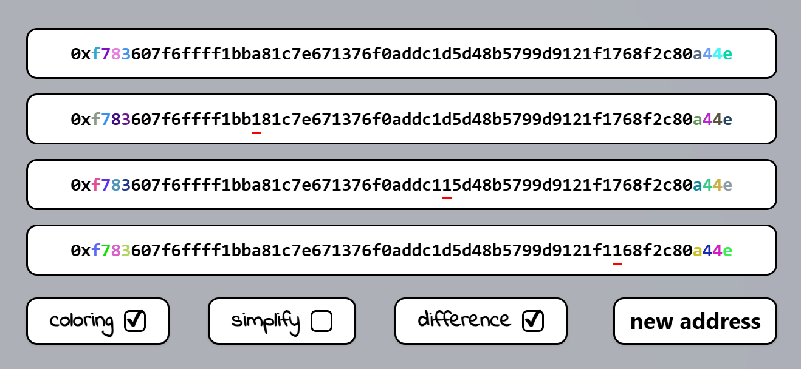
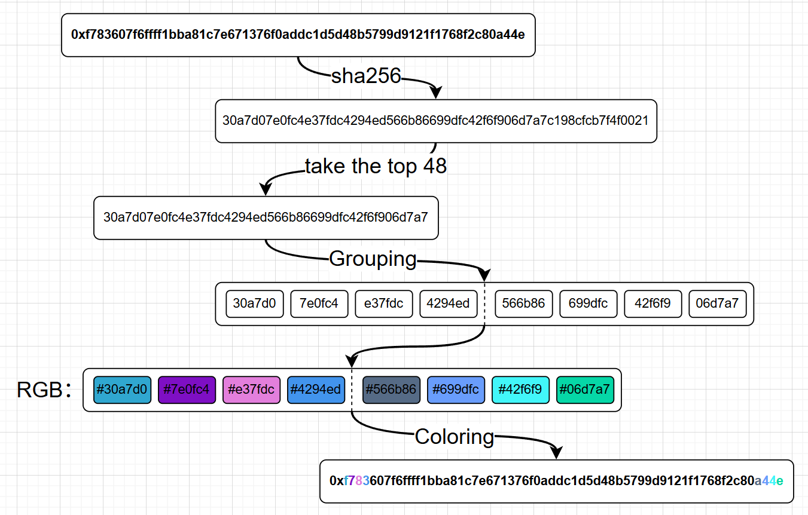

# [SafeColors](https://safe-colors.vercel.app/) 

[English Document](README.md) | [中文文档](README_zh.md)

Smart Address Coloring System - Securing cryptocurrency transactions through visual cryptography

## Project Overview

[SafeColors](https://safe-colors.vercel.app/) is an innovative address security verification tool. By adding unique color combinations to user addresses through encryption algorithms, this tool can effectively prevent the following risks:

- ✅ Phishing attacks using similar addresses
- ✅ Human verification errors
- ✅ Malicious address substitution

  
   

### The principle of wallet address dyeing algorithm

#### 1.   Hash generation
- Perform the SHA-256 encryption hash operation on the target wallet address to generate a hexadecimal string of a fixed length
#### 2.   Segment coding
- Take the first 48 hash values and split them into 8 groups in sequence, with each group containing 6 consecutive hexadecimal characters
#### 3.   Color mapping
- Parse each group of 6-digit characters into RGB color values (format: #RRGGBB), and generate 8 corresponding standard hexadecimal color codes
#### 4.   Dynamic rendering
- Based on the generated color sequence, the wallet address characters are colored to achieve address coloring

   

### Homepage
- https://safe-colors.vercel.app/