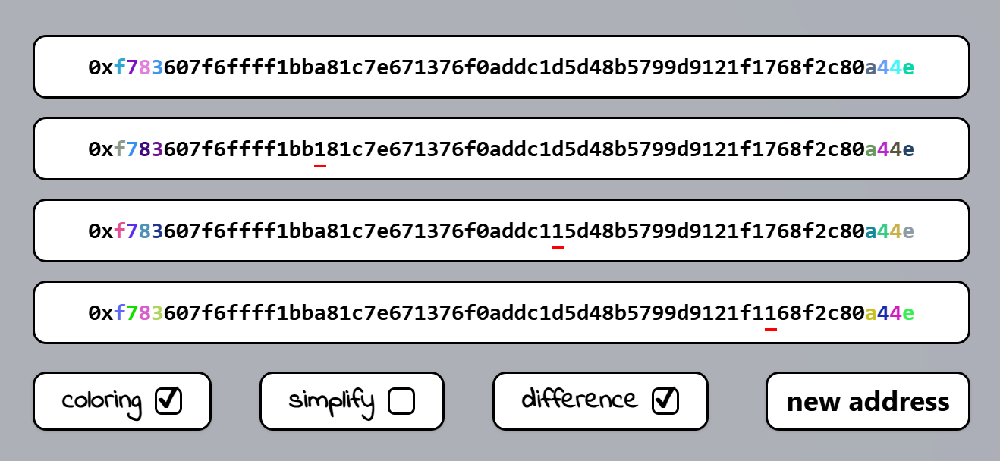

# [SafeColors](https://safe-colors.vercel.app/) 

[English Document](README.md) | [中文文档](README_zh.md)

智能地址染色系统 - 通过视觉密码学保护加密货币交易安全

## 项目简介

[SafeColors](https://safe-colors.vercel.app/) 是一款创新的地址安全验证工具，通过将加密算法给用户地址增添独特颜色组合的视觉标识系统，有效防范以下风险：
- ✅ 相似地址钓鱼攻击
- ✅ 人工校验失误
- ✅ 恶意地址替换

   

### 钱包地址染色算法原理

#### 1. 哈希生成
- 对目标钱包地址执行 SHA-256 加密哈希运算，生成固定长度的十六进制字符串

#### 2. 分段编码
- 取前48位哈希值按顺序拆分为8组，每组包含6位连续十六进制字符

#### 3. 色彩映射
- 将每组6位字符解析为RGB颜色值（格式：#RRGGBB），生成8个对应的标准十六进制颜色代码

#### 4. 动态渲染
- 根据生成的色彩序列，对钱包地址字符进行分段着色，实现地址染色

### 体验地址
- https://safe-colors.vercel.app/